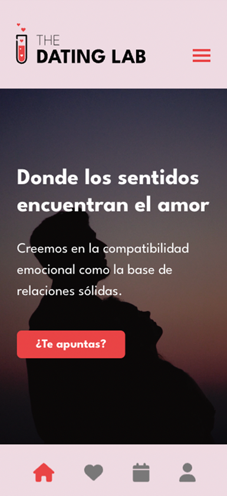
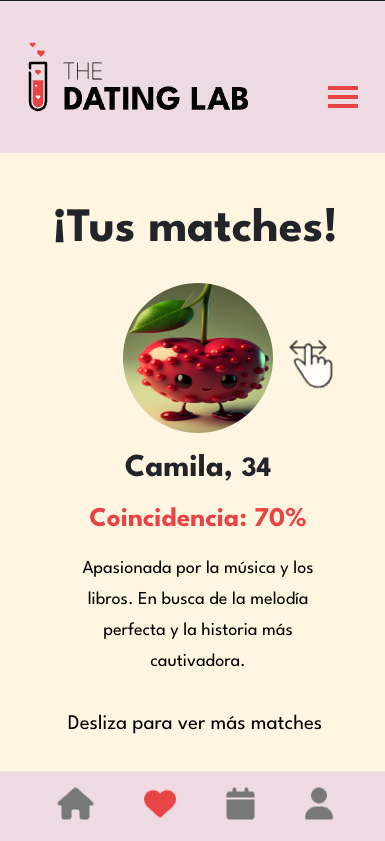
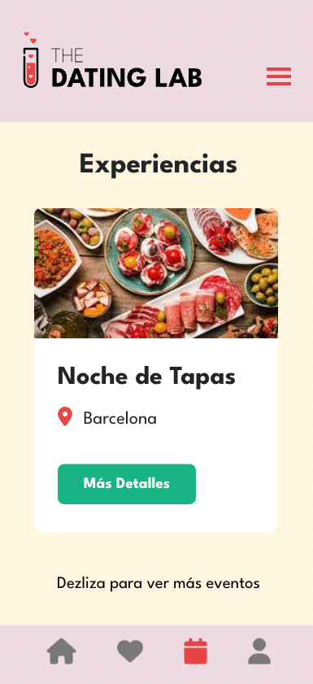

  

En el bootcamp de fullstack que estamos realizando en FemCoders , se nos brindó la oportunidad de trabajar en un emocionante proyecto junto a un cliente real. Nuestra misión es desarrollar una plataforma web que permitiera a las personas conectarse a través de sus sentidos, explorar eventos y descubrir afinidades compartidas.

## Sobre este proyecto
Al acceder a la página, los usuarios son recibidos con una intrigante introducción centrada en la búsqueda de su pareja ideal a través de la conexión sensorial. El primer paso es completar un formulario que evalúa la compatibilidad con otros usuarios, proporcionando valiosas recomendaciones de coincidencias. Luego, se les brinda la emocionante oportunidad de asistir a eventos sensoriales exclusivos, donde pueden conocer en persona a sus posibles coincidencias y vivir una experiencia única. Para acceder a estos eventos, los usuarios tienen la opción de pagar por eventos individuales o suscribirse a una membresía mensual a esta experiencia sensorial única.

## Objetivo del Proyecto
Una web responsive donde se pueda gestionar usuarios tanto registrados, como no, para que puedan ver de que se trata la pagina, y decidir si les interesa sumergirse en un espacio donde aparte de conocer a tu pareja ideal, podras experimentiar eventos únicos donde pasarla bien y conocer gente con los que compartas tus mismos gustos.

### Figma
| [] | [] | [] | [] 
| :---: | :---: | :---: | :---: |

  

#### 🛠 Tecnologías Utilizadas

 
 

#### 🛠 Herramientas Utilizadas

#### 🛠 Otros paquetes utilizados

### Instrucciones de Uso
Para aprovechar al máximo esta versión del proyecto, es fundamental seguir cuidadosamente las instrucciones de instalación tanto para el frontend como para el backend. Antes de continuar, asegúrate de contar con los siguientes requisitos previos:

+ Conocimientos en Mamp/Xamp: Para ejecutar este proyecto de manera efectiva, es imprescindible tener un buen entendimiento de cómo funcionan entornos de desarrollo como Mamp o Xamp. Estos son sistemas que proporcionan un servidor web local, una base de datos y otros servicios necesarios para ejecutar aplicaciones web. Si no estás familiarizado con Mamp o Xamp, te recomendamos adquirir conocimientos básicos antes de continuar.

+ Composer instalado: es una herramienta esencial para gestionar las dependencias de PHP en tu proyecto. Asegúrate de que Composer esté instalado en tu sistema antes de proceder. Si no lo tienes instalado, puedes encontrar instrucciones detalladas en https://getcomposer.org/ para instalarlo.

+ Conocimientos en MySQL: Debes estar familiarizado con la creación de bases de datos para aprovechar al máximo las funcionalidades del proyecto.

A continuación, se detallan los pasos para la instalación:

**Instalación del Proyecto Backend Laravel**
 1. Clona el repositorio de Laravel desde GitHut
 `https://github.com/thedatinglabbcn/thedatinglab.git`
 2. Abre el proyecto en tu editor de código y en la terminal ingresa al directorio del proyecto
 `cd server`
 3. Instala las dependencias de Composer
 `composer install`
 4. Crea un archivo .env a partir del archivo .env.example.
 5. Crea tú base de datos en mysql con el nombre de tú preferencia.
 6. Configura la base de datos en el archivo .env con la información adecuada, donde debes poner el nombre de tu base de datos previamente creada en mysql y tener claro cual es tu sistema operativo para la instalación.Ejemplo:
 <pre>
<code>
DB_CONNECTION=mysql
DB_HOST=127.0.0.1
DB_PORT=3306
DB_DATABASE=nombre_base_de_datos
DB_USERNAME=nombre_usuario
DB_PASSWORD=contraseña
</code>
</pre>
7. Ejecuta las migraciones para crear las tablas de la base de datos
`php artisan migrate`
8. Inicia el servidor de desarrollo
`php artisan serve`

**Instalación del Proyecto Frontend React**

1. ingresa al directorio del proyecto
 `cd client`
2. Instala las dependencias de npm
`npm install`
3. Inicia el proyecto
`npm start`
4. El frontend de React ahora está en funcionamiento y se ejecuta en 
`http://localhost:3000`

## Developers
## Autores

| [ Jeaneth Sánchez Núñez](https://github.com/jeanethsn) | [ Rosa Rubio](https://github.com/rosa-rubio) | [ Denise Khurlopian](https://github.com/dkhurlop) | [ Florencia Bordon](https://github.com/florienborg)
| :---: | :---: | :---: | :---: |

